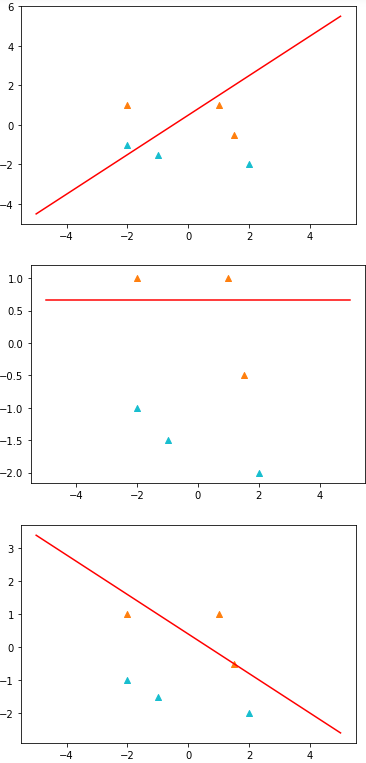
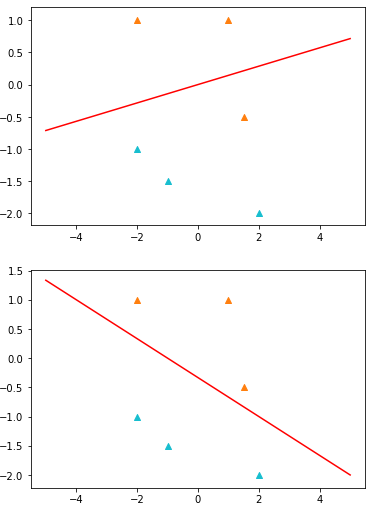
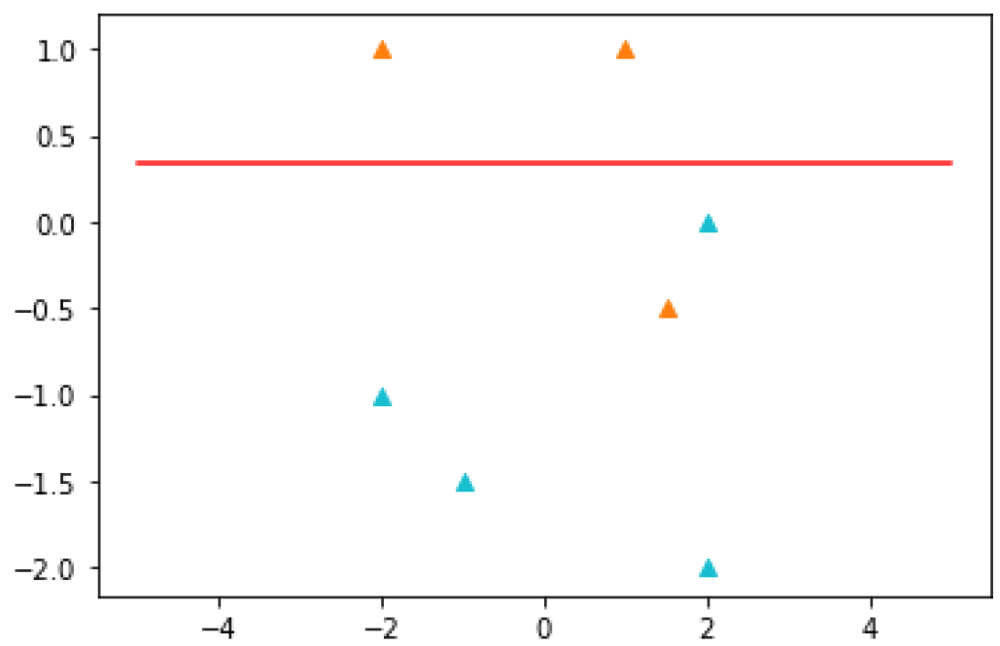

# Perceptron
 The objective was to perform perceptron algorithm for any number of given datapoints and adding a minimum number of data points to make the dataset non-linearly separable.  
 
 For this purpose, the given dtapoints were- 

 D = ([(1; 1); +1]; [(2;-2);-1]; [(-1;-1:5);-1]; [(-2;-1);-1]; [(-2; 1); +1]; [(1:5;-0:5); +1])
 
 Resulting hyperplane of each iteration is plotted with the datapoints till convergence is achieved. 

 

  

  
  
The final hyperplane for linearly separable data.

Adding [2,0] with label -1 to the data points makes the dataset not-linearly separable. In this case, the algorithm will run for 100 iterations before showing the resulting hyperplane for non-separable datapoints and printing- 
'convergence not achieved'.

  
  The final hyperplane for non-separable data.

